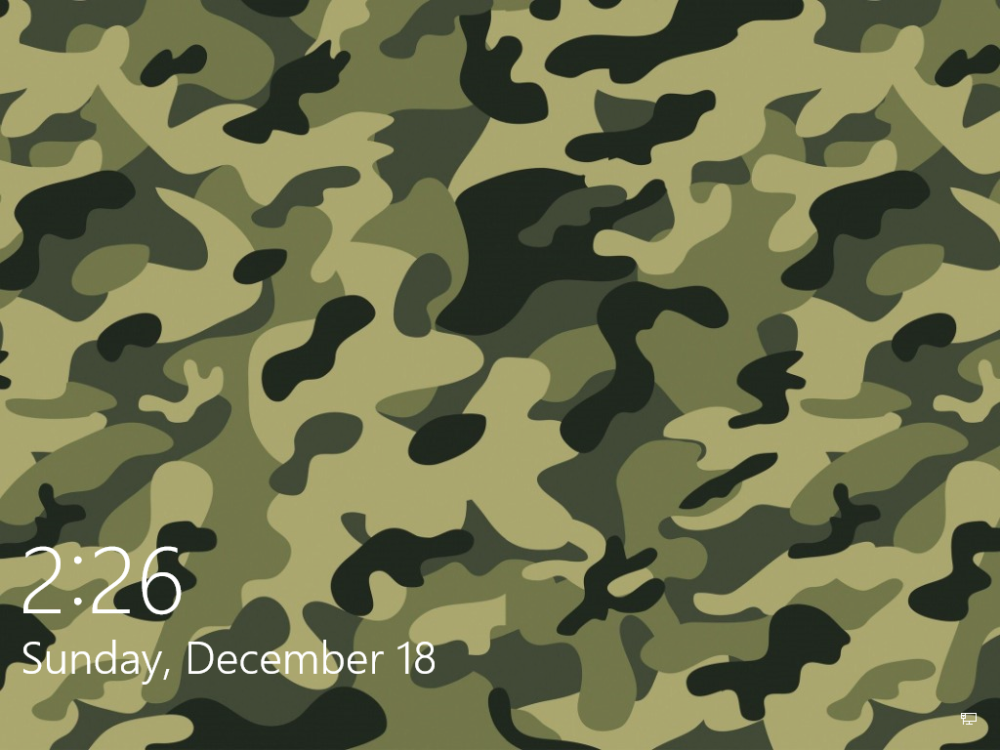
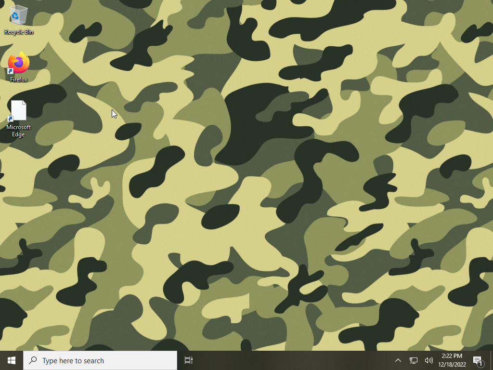

Need to protect yourself from the CIA? Journalist? We got you covered. 
### Private. Check.
### Secure. Check.
### Trustworthy. Check.
Do you still need your computer to the internet? Don't worry! Microsoft is not recieving almost anything using O&O ShutUp! With BitLocker included, protect yourself from sophisticated people stealing your data.
## What does it look like?

## You deserve to be private.
Some people almost got into jail because they were on their bike near a crime scene because of Google!
## And be secure.
With Windows Defender built-in, you can stay away from viruses!
## And compatible.
CamoOS is compatible with every Windows program out there!¹
## Do we need to say any more?
We know you want it, here you go.
https://github.com/CamoOS/CamoOS#-how-do-i-create-a-camoos-iso
Oh, and download the source from the releases, obviously.
#### Footnotes
¹Some programs (especially games and education software) have anti-cheat that may prevent CamoOS from running the program.
